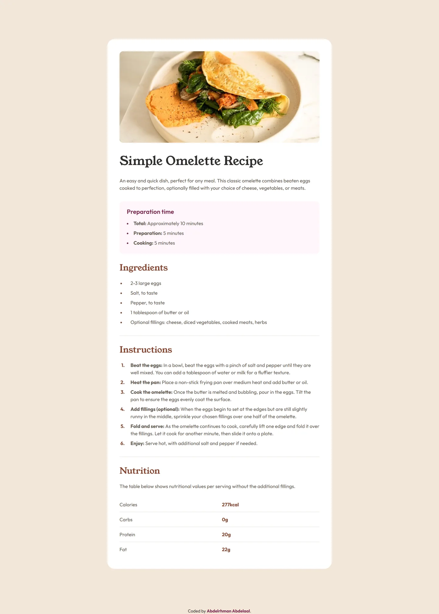

# Frontend Mentor - Recipe Page solution

This is a solution to the [Recipe Page challenge on Frontend Mentor](https://www.frontendmentor.io/challenges/recipe-page-KiTsR8QQKm). Frontend Mentor challenges help you improve your coding skills by building realistic projects.

## Table of contents

- [Overview](#overview)
  - [Screenshot](#screenshot)
  - [Links](#links)
- [My process](#my-process)
  - [Built with](#built-with)
  - [What I learned](#what-i-learned)
- [Author](#author)

## Overview

### Screenshot



### Links

- Solution URL: [GitHub](https://github.com/MrBlackvanta/recipe-page)
- Live Site URL: [Cloudflare](https://recipe-page.abdelrhman-ahmed8881.workers.dev)

## My process

### Built with

- [Next.js 16](https://nextjs.org/) (App Router, React Compiler, Turbopack)
- [React 19](https://react.dev/)
- TypeScript
- [Tailwind CSS v4](https://tailwindcss.com/) (theme via `@theme`, type presets via `@utility`)
- `next/font` for Young Serif + Outfit (self-hosted, `display: swap`)
- Semantic HTML5 landmarks (`<main>`, `<section>`, `<footer>`)
- Mobile-first responsive layout, a single `sm:` breakpoint
- Fully static output — pre-rendered at build time

### What I learned

**`next/image` has two sizing modes and they solve different problems.** With `width` / `height` you give the image's intrinsic dimensions and it renders at its natural aspect ratio — style it with `w-full h-auto` and it scales responsively. With `fill` you let it stretch to fill an arbitrary box (parent must be `position: relative` with explicit dimensions) — useful when you need to crop with `object-cover`. For this challenge the image keeps the same aspect ratio across breakpoints, so `width` / `height` was the right tool. I started with `fill` and tied myself in knots before stepping back.

**The `sizes` prop is a hint to the browser, not a CSS rule.** It describes how wide the image will be displayed at each viewport, so the browser can pick the smallest variant from the generated `srcSet` that still fits. Without it (and with explicit `width`/`height`), Next was serving the 1920w variant on every screen — a giant waste on mobile. The format is a media-query list evaluated first-match-wins, so order largest → smallest:

```tsx
sizes = "(min-width: 1024px) 41rem, (min-width: 768px) 33.5rem, 100vw";
```

The breakpoints should match where your _layout_ changes, not arbitrary numbers. For an image where mobile is full-bleed, `100vw` as the fallback is more honest than a fixed rem value.

**Marking up the LCP image.** Next's dev console flags the largest contentful paint element if it's not eagerly loaded. Adding `fetchPriority="high"` and `loading="eager"` (or simply `priority`) tells the browser to prioritize the fetch. Above-the-fold hero images need this — exactly one per page.

**`<figure>` is for self-contained media, not page layout.** I wrapped the recipe image in a `<figure>` and put the `<h1>` and lead paragraph inside `<figcaption>`. That's wrong: a `<figcaption>` captions the figure, but my heading and description were the page's primary content, not a description of the image. Dropping the wrapper and letting the image, heading, and description sit as siblings was the cleaner answer. `<figure>` earns its keep when the media is referenced from elsewhere in the flow ("see Figure 1") — not for arbitrary "image plus text" groupings.

**Tailwind v4 type presets via `@utility`.** Frontend Mentor style guides typically define a handful of typography presets (`text-preset-1`, `text-preset-2`, …) that bundle font-family, size, weight, and line-height. v4's `@utility` directive lets you declare those once and reuse them, with full support for variants like `sm:text-preset-1`:

```css
@utility text-preset-1 {
  @apply font-young-serif text-4xl leading-none sm:text-[2.5rem];
}
```

Cleaner than repeating the same four utilities everywhere, and unlike a `@layer components` class it composes with variant prefixes correctly.

## Author

- UpWork - [Abdelrhman Abdelaal](https://www.upwork.com/freelancers/mrblackvanta)
- Frontend Mentor - [@MrBlackvanta](https://www.frontendmentor.io/profile/MrBlackvanta)
- LinkedIn - [Abdelrhman Abdelaal](https://www.linkedin.com/in/abdelrhman-vanta/)
